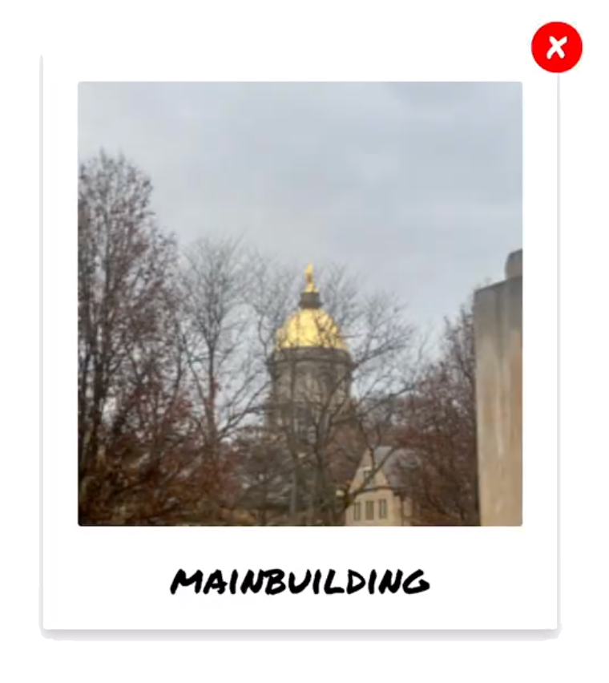
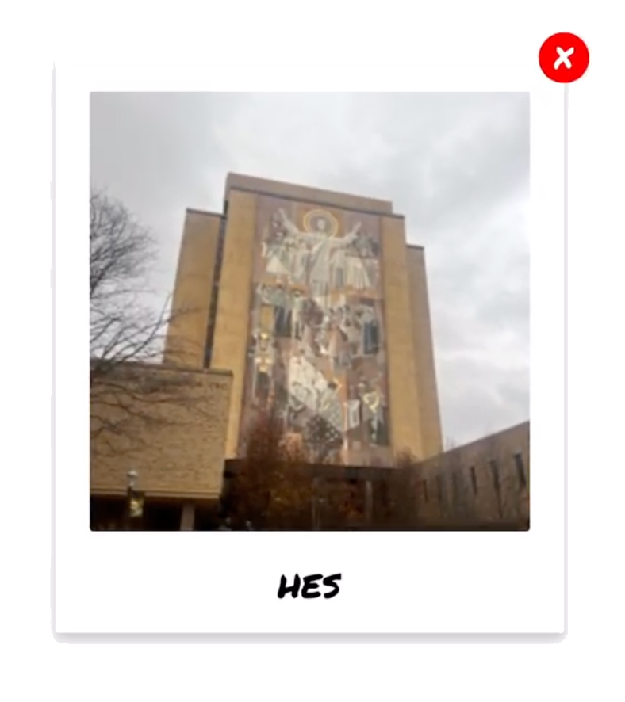

<h1>
    
    Magic Polaroid 
    
</h1>

> Final Project for Distributed Systems - CSE 40771

**Magic Polaroid** is a distributed computer vision system and mobile app that labels photos taken on the University of Notre Dame's campus by location. 


Additionally, users can submit their photos to our backend, which periodically fine-tunes our classification model and redeploys the improved model automatically as people use our app. 

In this way, **Magic Polaroid** acts as both a fun AI application and a way to crowd-source location-labeled images on Notre Dame's campus.

[Link to Demo Video](https://drive.google.com/file/d/1cD5FMj5SmU5FbpTkUCZSCFq5f1kwleLU/view?usp=sharing)

## Table of Contents
- [Getting Started](#getting-started)
- [Training Overview](#training-overview)
- [System Diagrams](#system-diagrams)
- [Performance Evaluation](#performance-evaluation)
- [Cost Evaluation](#cost-evaluation)

## Getting Started
**Note:** This project uses the Notre Dame catalog server. If you wish to develop this further, please replace with your own name server.

### Backend

```bash
# Install dependencies
cd backend
pip install -r requirements.txt

# Run backend server
python3 server.py
```

### Frontend
```bash
# Install dependencies
cd mobile-application
yarn

# Run application
yarn start

# Press 'i' to open iOS Simulator on Mac
# or
# Download Expo Go on your mobile device to test
```

### ML Worker Node (Google Colab)

**Important Note:** This was an interesting and cost-effective approach for our class project, but it is against Google Colab policy to deploy worker nodes using their service.

```
Open MagicPolaroidAdmin.ipynb on Google Colab with a GPU runtime
```

## Training Overview

We used a transfer learning approach to adapt [MobileNetV2](https://www.tensorflow.org/api_docs/python/tf/keras/applications/MobileNetV2) to our own use-case. Our initial [dataset](/classification-server/training_images/) includes photos for 13 main locations on campus.

## System Diagrams


## Performance Evaluation


## Cost Evaluation

